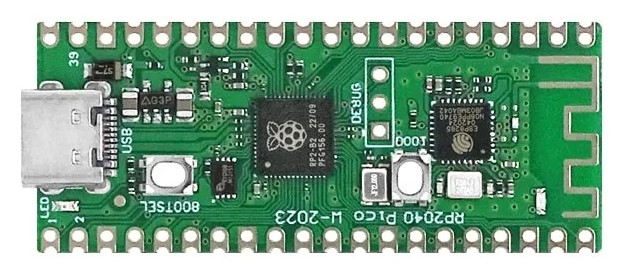

# Project

There is a Raspberry Pi Pico Board on the market called PICO-W that uses the ESP8285 wifi chip instead of the Infineon CYW43439. This is a problem because pre-built wifi libraries for PICO-W won't work.



# Goal

I tried to create a simple Python library to be able to use the wifi part of the board. The inspiration for the API was the API that is used in Arduino.

# Project Status

The project is by no means in production state. You can consider it as a proof of concept. Nevertheless I tried to make it functional and useful.

The project started as two Python files - one for the API and one for the driver. It now also includes MicroPython compatibility layers for `network`, `socket` and `ssl`, so existing code written for the standard MicroPython networking API can often run with fewer changes.

You can use the library to join a wifi network, configure the network interface, discover access points, open TCP/UDP/SSL connections, run a simple TCP server and communicate with remote peers.

On the ESP8285 side, an AT-interpreter must be installed. You can use the official one from Espressif or you can use another one from independent projects. I use my code [https://github.com/JiriBilek/ESP_ATMod](https://github.com/JiriBilek/ESP_ATMod) because it can connect to servers using TLS1.2.

I could complete the project with all the bells and whistles of the Arduino wifi library but I doubt it would be useful. It would fill PICO's memory with a Python code that is rarely used. So I focused on the basic functionality.

## What Works Now

- join AP as a client (in ESP terminology "station")

- configure static IP, gateway, subnet mask and DNS

- get information about the current connection, SSID, BSSID, RSSI, channel, hostname and MAC address

- discover and list nearby APs

- connect to TCP, UDP or SSL/TLS servers

- send data to the server and read data from the server

- start a simple AP

- start a simple TCP server and accept incoming clients

- use compatibility layers for `network.WLAN`, `socket` and `ssl.wrap_socket`

## The Future

- enable advanced TLS features like fingerprint validation, certificate chain validation etc.

- improve API completeness and compatibility with the full MicroPython networking stack

- harden error handling and long-running reliability

- add more examples for client, server, AP and UDP use cases

# Credits

The first idea came from the [https://github.com/mocacinno/rp2040_with_esp8285](https://github.com/mocacinno/rp2040_with_esp8285) repository. I learned what I needed to do to make the wifi part of the board work.

The Arduino AT library I tried to port to Micropython was [https://github.com/JAndrassy/WiFiEspAT](https://github.com/JAndrassy/WiFiEspAT). It is a library with a robust implementation of the communication with the ESP MCU.

Recent changes in this repository were produced with Claude Opus 4.6 based on my prompts, testing and integration work. I am keeping this note here because I do not want to take credit for code I did not write myself.

Thanks guys.

# Installation

## 1. Reflash ESP8285 Chip With AT Firmware

- unplug Pico from the USB, press the button near the USB-C connector (BOOTSEL) and plug it back while holding the button. In Explorer you should see a new disk drive called *RPI-RP2*.

- copy the file *Serial\_port_transmission.uf2* into this new drive. Now, the PICO works as a USB to serial converter.

- unplug the Pico from the USB, press the button near the Wifi chip (on my board it is called DOOT) and plug it back while holding the button. Now you have the ESP8285 in firmware download mode.

- download the AT command interpreter to the ESP8285. You can use any AT firmware for ESP8285 or ESP8266. I recommend using my firmware from the repository [https://github.com/JiriBilek/ESP_ATMod](https://github.com/JiriBilek/ESP_ATMod). This firmware uses modern TLS ciphers required for TLS1.2.

	The Pico is now working as a USB to serial converter so that you will see it as a new COM port. Use this port for flashing. Choose **one** method:

	- if you are familiar with Arduino you can clone the repository above, compile the code and flash it into the ESP8255. 
	
	- or use the pre-compiled AT firmware and *esptool.exe* from [https://github.com/espressif/esptool/releases](https://github.com/espressif/esptool/releases). Download the zip file, extract it and flash the firmware with the command:

		**esptool --port *<your com port\>* write\_flash 0x0 ESP_ATMod.0.6.bin**

	- or use the flash download tool from Espressif. Follow the instructions at [https://github.com/mocacinno/rp2040_with_esp8285/blob/main/README.md](https://github.com/mocacinno/rp2040_with_esp8285/blob/main/README.md).

	You can verify the firmware is running correctly by replugging the board, connecting a serial terminal (e.g. PuTTY) to the COM port on 115200 Bd and typing **AT** followed by *Enter* and *Ctrl-J*. The ESP8285 should respond **OK**.

## 2. Flash Micropython to the PICO-W

- bring the Pico into the download mode as you did at the beginning of this process (unplug - press BOOT - plug again).

- get the latest Pico firmware from [https://micropython.org/download/RPI_PICO/](https://micropython.org/download/RPI_PICO/). Don't use the firmware for Pico-W because you don't need the stuff for the CYW chip.

- flash the firmware by copying the uf2 file to the Pico disk drive.

## 3. Download the Library to the Pico W

- start Thonny on your computer, connect the Pico board and copy the files from the *lib* directory to the board. At minimum you need *WiFi.py* and *EspAtDrv.py*. If you want MicroPython compatibility imports, also copy *network.py*, *socket.py* and *ssl.py*.

- Testing: in the *wifitest.py* file, set the SSID and PWD variables according to your network and run it from Thonny.

# API

Import *WiFi.py* into your project and use the following API. If you prefer the standard MicroPython style, the repository also provides lightweight compatibility modules named *network.py*, *socket.py* and *ssl.py*.

## General Communication

### Constants

```
WL_NO_SHIELD = const(255)
WL_NO_MODULE = WL_NO_SHIELD
WL_IDLE_STATUS = const(0)
WL_CONNECTED = const(1)
WL_CONNECT_FAILED = const(2)
WL_CONNECTION_LOST = const(3)
WL_DISCONNECTED = const(4)
WL_AP_LISTENING = const(5)
WL_AP_CONNECTED = const(6)
WL_AP_FAILED = const(7)
WL_SRV_CLOSED = const(8)
WL_SRV_LISTEN = const(9)
```
### init(resetType: int) -> int

Initialize the wifi communication. Must be the first command in the application.

*resetType*: 0 - perform software reset, otherwise no reset

### status() -> int

Get the wifi connection status.

### begin(ssid: str, passphrase: str, bssid: bytearray = None)

Connect to the AP with the specified SSID and password. If the *bssid* parameter is specified, connect to the AP with that BSSID.

### disconnect(persistent: int) -> int

Disconnect from the AP. When persistent, the wifi device will automatically reconnect on boot.

### setPersistent(persistent: int) -> int

Set or get persistency of the newly created connections to APs. When persistent, the wifi device will automatically reconnect on boot.

### rssi() -> int

Return current RSSI or *None*.

### channel() -> int

Returns wifi channel  or *None*.

### localIp() -> str

Returns local IP address as string or *None*.

### gatewayIp() -> str

Returns gateway address or *None*.

### subnetMask() -> str

Returns subnet mask or *None*.

### dnsIp(n: int = None)

n == None: Returns an array of DNS server addresses or *None*.  
n != None: Returns n-th DNS server address or *None*.

### autoConnect(autoconnect: int) -> int

Enable or disable automatic reconnection on boot.

### config(localIp: str, dnsServer: str = None, gateway: str = None, subnet: str = None)

Configure a static IP address. If *dnsServer* is provided, also set DNS.

### setDns(dnsServer1: str, dnsServer2: str = None)

Set one or two DNS servers.

### hostName(name: str = None) -> str

If *name* is provided, set the station hostname. Otherwise return the current hostname.

### macAddress() -> str

Return the station MAC address as a string.

### dhcpIsEnabled() -> int

Returns the current DHCP state. At the moment this is only a convenience wrapper and assumes DHCP is enabled by default.

### ssid() -> str

Return the SSID of the currently connected AP or *None*.

### bssid() -> str

Return the BSSID of the currently connected AP or *None*.

### scanNetworks() -> list

Scan nearby access points and return a list of tuples in the form *(ssid, mac, channel, rssi, encryption)*.

### beginAP(ssid: str, password: str = None, channel: int = 1, enc: int = 0) -> int

Start AP mode. If *password* is provided and *enc* is zero, WPA2-PSK is selected automatically.

### endAP(persistent: int = False)

Stop AP mode and return to station mode.

## Client

First, you need to get the wifi client object: **WiFi.Client()**. Then you can use its methods:

### connect(host: str, port: int) -> int

Connect in TCP mode to *host* on port *port*. Returns *True* is successful.

### connectSSL(host: str, port: int) -> int

Connect in SSL (TLS) mode to *host* on port *port*. Returns *True* is successful.

### connected() -> int

Returns the state of the client. *True* means connected.

### flush()

Flushes the output buffer to the server.

### stop()

Flushes the output buffer to the server and stops the connection.

### abort()

Aborts the connection.

### print(data: str) -> int

Sends data to server. The data are internally buffered until *available()*, *read()*, *readBuf()* or *flush()* is called.

### available() -> int

Returns the number of bytes in the input buffer. Flushes the output buffer first.

### peek() -> int

If the input buffer is not empty, returns the first byte without discarding it. Otherwise returns -1.

### read() -> int

Returns one byte from the input buffer. If the buffer is empty, returns -1.

### readBuf(size: int) -> bytes

Returns at most *size* bytes from the input buffer. May return empty array.

## Server

Create a server object with **WiFi.Server(port)**.

### begin(timeout: int = 30)

Start a TCP server on the configured port. *timeout* is the idle client timeout in seconds.

### end()

Stop the server.

### setTimeout(timeout: int)

Change the server idle timeout.

### status()

Returns the status of the TCP server. Values are WL\_SRV\_CLOSED (8) or
WL\_SRV\_LISTEN (9).

### available() -> Client

Return the next incoming client as a **WiFi.Client()** object, or *None* if no client is waiting.

## Compatibility Layers

The files *network.py*, *socket.py* and *ssl.py* implement a small compatibility layer for code that expects the usual MicroPython networking modules.

### network.WLAN

Supports the common station and AP operations such as *active()*, *connect()*, *disconnect()*, *isconnected()*, *status()*, *ifconfig()*, *config()* and *scan()*.

### socket.socket

Supports TCP client sockets, UDP sockets, simple listening TCP sockets, blocking/non-blocking mode, timeouts and file-like helpers such as *read()*, *readline()* and *readinto()*.

### ssl.wrap_socket

Wrap a compatible socket so that the ESP8285 opens the connection in native SSL/TLS mode.

# Minimum example

```
import utime  
import WiFi  
  
WiFi.init(0)
WiFi.begin("<<YOUR SSID>>", "<<YOUR PASSWORD>>")
if (WiFi.status() == WiFi.WL_CONNECTED):
    cli = WiFi.Client()
    if (cli.connectSSL("www.example.com", "443")):
        cli.print("GET / HTTP/1.1\r\nHost: www.example.com\r\n\r\n")
        t = utime.ticks_ms()
        while (cli.available() == 0 and utime.ticks_ms() - t < 5000):  # timeout 5 s
            utime.sleep(0.01)
        resp = bytearray()
        while (cli.available()):
            b = cli.readBuf(cli.available())
            resp += b
            t = utime.ticks_ms()
            while (cli.available() == 0 and utime.ticks_ms() - t < 1000):  # timeout 1 s
                utime.sleep(0.01)
        print(resp)
    cli.stop()
WiFi.disconnect(False)
```




